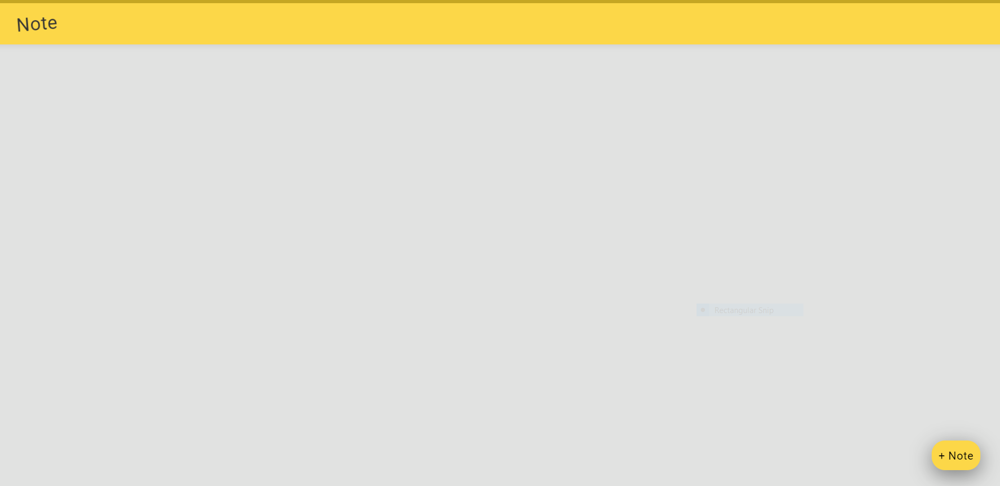
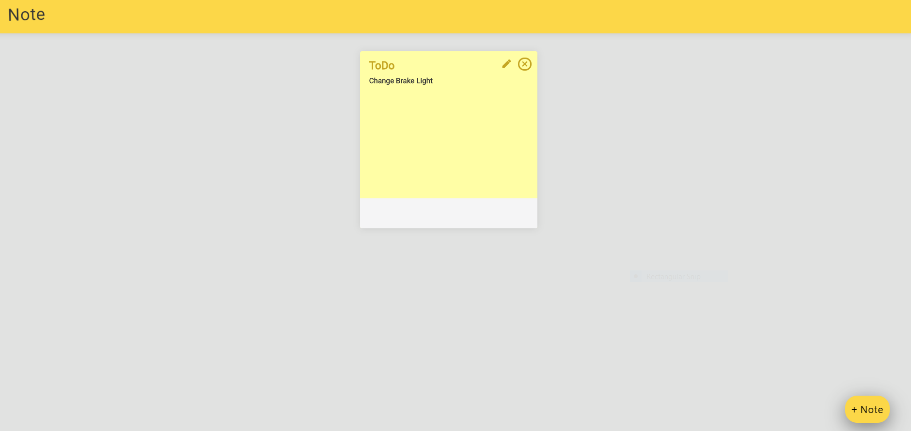
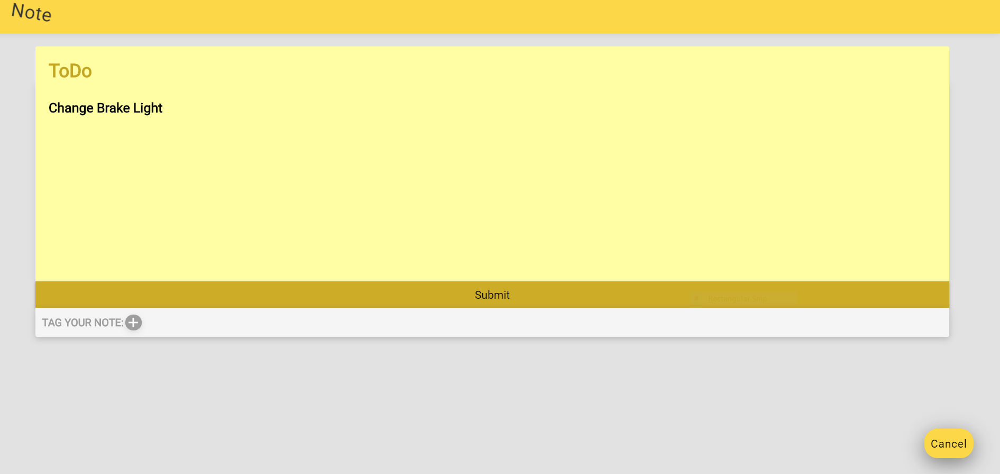

You can create,update,and delete your own notes on this fluid user interface! 

How to use:

1) https://note-app-note-carl-hofstrom.herokuapp.com
2) Click '+ Note' at bottom right, add data accordingly, Click 'Submit'

3) Edit note by Clicking the pencil in top right of the note, Click 'Submit'

4) Click '+' at bottom left to Tag your note, ex. Done, In Progress.., Click 'Submit'
5) Click 'X' in top right of note to delete note

Application Features:

Back-end set up using a pre-built Note API @ https://note-api-carl-hofstrom.herokuapp.com/notes
Front-end https://github.com/facebook/create-react-app
Flash notifications that alert user of validation errors 

Built with ReactJS by Carl Hofstrom
hofstromcarl@gmail.com

https://note-app-note-carl-hofstrom.herokuapp.com
